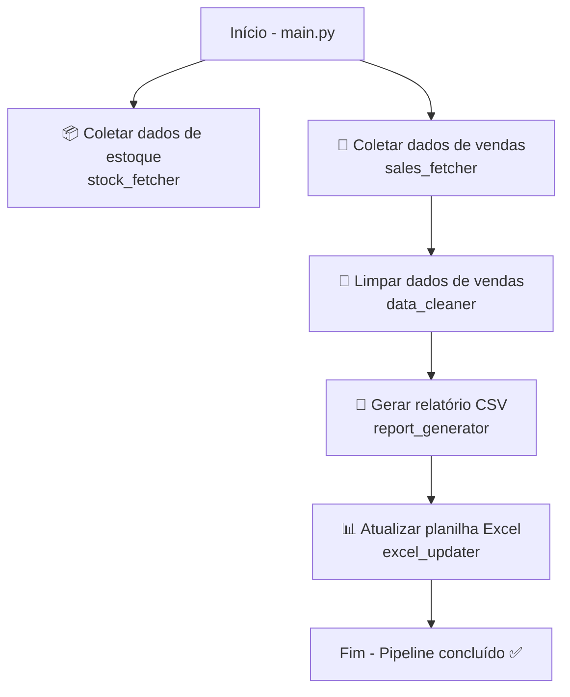

<<<<<<< HEAD
=======

>>>>>>> db04df7bb50a09519662ef690ea96cb14db5683e
# 📊 Pipeline de Coleta e Relatórios de Estoque & Vendas

Este projeto implementa um **pipeline automatizado** para:

1. **Coletar dados de estoque** via API.
2. **Coletar vendas dos últimos 366 dias** via API.
3. **Limpar os dados de vendas**.
4. **Gerar relatórios consolidados em CSV**.
5. **Atualizar uma planilha Excel** com os resultados processados.

---

## 🚀 Estrutura do Projeto

```
src/
│── main.py                # Orquestra o pipeline completo
│
└── modules/
    ├── auth.py             # Autenticação com API (token + assinatura HMAC)
    ├── stock_fetcher.py    # Coleta de dados de estoque
    ├── sales_fetcher.py    # Coleta de dados de vendas
    ├── data_cleaner.py     # Limpeza e padronização dos dados de vendas
    ├── report_generator.py # Consolidação em CSV
    └── excel_updater.py    # Atualização da planilha Excel
```

---

## ⚙️ Fluxo do Pipeline (Diagrama)



---

## ⚙️ Funcionalidades dos Módulos

### `main.py`

Executa o pipeline completo na ordem correta.

### `auth.py`

* Gera assinaturas HMAC-SHA256.
* Obtém token de acesso à API.

### `stock_fetcher.py`

* Lê IDs de produtos (`data/id.csv`).
* Consulta API de estoque.
* Salva em `data/raw/dados_de_estoque_compilado.json`.

### `sales_fetcher.py`

* Coleta vendas dos últimos 366 dias.
* Salva em `data/raw/saidas_ultimos_366_dias.json`.

### `data_cleaner.py`

* Filtra apenas vendas (VND).
* Mantém campos essenciais.
* Salva em `data/limpa/vendas.json`.

### `report_generator.py`

* Consolida **média de vendas**, **vendas 2025** e **estoque atual**.
* Gera `data/resultados/resultado.csv`.

### `excel_updater.py`

* Atualiza `ESTOQUE PRODUTOS REVISTAS.xlsx`.
* Substitui/atualiza aba `info_tempo_real`.

---

## 📂 Estrutura de Dados

```
data/
│── id.csv
│
├── raw/
│   ├── saidas_ultimos_366_dias.json
│   └── dados_de_estoque_compilado.json
│
├── limpa/
│   └── vendas.json
│
└── resultados/
    ├── resultado.csv
    └── ESTOQUE PRODUTOS REVISTAS.xlsx
```

---

## ▶️ Como Executar

1. Instale dependências:

   ```bash
   pip install requests pandas openpyxl
   ```

2. Execute o pipeline:

   ```bash
   python src/main.py
   ```

3. Resultados:

   * `data/resultados/resultado.csv`
   * `data/resultados/ESTOQUE PRODUTOS REVISTAS.xlsx`

---

## 📝 Observações

* Autenticação via **HMAC-SHA256 + Token**.
* Coleta de vendas é **incremental**.
* Excel mantém outras abas, apenas `info_tempo_real` é substituída.
